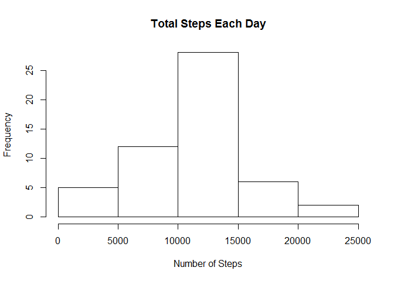
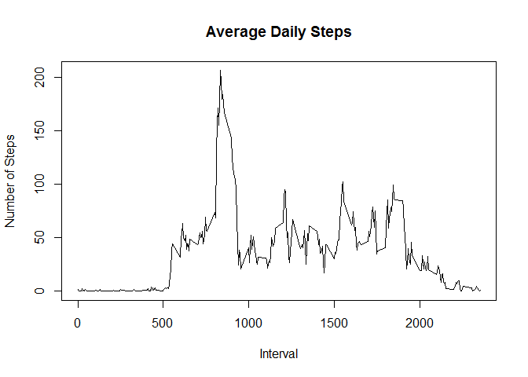
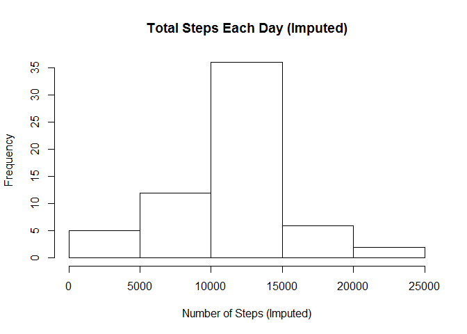
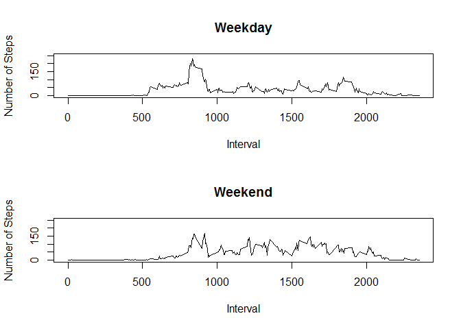

# Reproducible Research: Peer Assessment 1


## Loading and preprocessing the data

```r
pth <- "D:/Dropbox/E-books/_Coursera/5_Reproducible_Research/Week_2/assigment_1"
setwd(pth)
activity <- read.csv("activity.csv", header=T, stringsAsFactors=F)
```

## What is mean total number of steps taken per day?

1. Make a histogram of the total number of steps taken each day

```r
# group data by date
total_steps <- aggregate(steps ~ date, data = activity, sum, na.rm = TRUE)
hist(total_steps$steps, main = "Total Steps Each Day", xlab="Number of Steps")
```



2. Calculate and report the mean and median total number of steps taken per day

```r
mean_daily_total_steps <- mean(total_steps$steps)
median_daily_total_steps <- median(total_steps$steps)
cat("mean total number of steps taken per day is", mean_daily_total_steps)
```

```
## mean total number of steps taken per day is 10766.19
```

```r
cat("median total number of steps taken per day is", median_daily_total_steps)
```

```
## median total number of steps taken per day is 10765
```


## What is the average daily activity pattern?

```r
steps_interval <- aggregate(steps ~ interval, data = activity, mean, na.rm = TRUE)
```

1. Make a time series plot (i.e. type = "l") of the 5-minute interval (x-axis) and the average number of steps taken, averaged across all days (y-axis)

```r
plot(steps ~ interval, data = steps_interval, type = "l", main = "Average Daily Steps", xlab="Interval", ylab="Number of Steps")
```



2. Which 5-minute interval, on average across all the days in the dataset, contains the maximum number of steps?

```r
steps_interval[which.max(steps_interval$steps), ]$interval
```

```
## [1] 835
```


## Imputing missing values
Note that there are a number of days/intervals where there are missing values (coded as NA). The presence of missing days may introduce bias into some calculations or summaries of the data.

1. Calculate and report the total number of missing values in the dataset (i.e. the total number of rows with NAs)

```r
sum(is.na(activity$steps))
```

```
## [1] 2304
```

2. Devise a strategy for filling in all of the missing values in the dataset. The strategy does not need to be sophisticated. For example, you could use the mean/median for that day, or the mean for that 5-minute interval, etc.

Solution: Missing values will be replaced by the mean value (excluding missing values) of the same interval across the whole sampling period

```r
# estimate average for non-missing values by intervals across the whole sampling period
mean_steps_interval <- aggregate(steps ~ interval, data = activity, mean, na.rm = TRUE)

# merge original and imputed data
temp <- merge(activity, mean_steps_interval, by="interval")

#create a new column "steps.final" and its value will be imputed if original data is missing
for (k in 1:dim(temp)[1]) {
	if (is.na(temp[k, 'steps.x'])){
		temp[k, 'steps.final'] <- temp[k, 'steps.y']
	}
	else{
		temp[k, 'steps.final'] <- temp[k, 'steps.x']
	}

}
```

3. Create a new dataset that is equal to the original dataset but with the missing data filled in.

```r
activity_imputed <- subset(temp, select=c("interval", "date", "steps.final", "interval"))
names(activity_imputed)[3] <- "steps"
```

4. Make a histogram of the total number of steps taken each day and Calculate and report the mean and median total number of steps taken per day. 

```r
total_steps_imputed <- aggregate(steps ~ date, data = activity_imputed, sum)
hist(total_steps_imputed$steps, main = "Total Steps Each Day (Imputed)", xlab="Number of Steps (Imputed)")
```



5. Do these values differ from the estimates from the first part of the assignment? 

```r
library(knitr)
mean_imputed <- mean(total_steps_imputed$steps)
median_imputed <- median(total_steps_imputed$steps)
cat("mean total number of steps taken per day (for imputed data) is", mean_daily_total_steps)
```

```
## mean total number of steps taken per day (for imputed data) is 10766.19
```

```r
cat("median total number of steps taken per day (for imputed data) is", median_daily_total_steps)
```

```
## median total number of steps taken per day (for imputed data) is 10765
```

```r
compare_steps <- data.frame(original=c(mean_imputed,mean_imputed), imputed=c(mean_daily_total_steps, median_daily_total_steps), row.names = c("Mean daily total steps", "Median daily total steps"))
kable(compare_steps, format = "markdown")
```


|                         | original|  imputed|
|:------------------------|--------:|--------:|
|Mean daily total steps   | 10766.19| 10766.19|
|Median daily total steps | 10766.19| 10765.00|

The mean value remains the same, but the median value shows a little difference.

6. What is the impact of imputing missing data on the estimates of the total daily number of steps?

* The mean value remains the same since previously it was estimated after removing missing values. 
* The median value shows a little difference since but it depends on the positions of missing values.


## Are there differences in activity patterns between weekdays and weekends?

For this part the weekdays() function may be of some help here. Use the dataset with the filled-in missing values for this part.

1. Create a new factor variable in the dataset with two levels -- "weekday" and "weekend" indicating whether a given date is a weekday or weekend day.

```r
activity_imputed$day <- weekdays(as.Date(activity_imputed$date))
activity_imputed$weekdays <- as.factor(ifelse(activity_imputed$day %in% c("Saturday", "Sunday"), "Weekend", "Weekday"))
```

2. Make a panel plot containing a time series plot (i.e. type = "l") of the 5-minute interval (x-axis) and the average number of steps taken, averaged across all weekday days or weekend days (y-axis). The plot should look something like the following, which was created using simulated data:

```r
# find mean by intervals and type of the day (i.e., weekday or weekend)
total_steps_imputed_weekday <- aggregate(steps ~ interval  + weekdays, data = activity_imputed, mean)

# begin to plot
par(mfrow=c(2,1))
plot(steps ~ interval, data = total_steps_imputed_weekday[total_steps_imputed_weekday$weekdays=="Weekday",], type = "l", main = "Weekday", xlab="Interval", ylab="Number of Steps", ylim=c(0, 250))


plot(steps ~ interval, data = total_steps_imputed_weekday[total_steps_imputed_weekday$weekdays=="Weekend",], type = "l", main = "Weekend", xlab="Interval", ylab="Number of Steps", ylim=c(0, 250))
```



